# Bayesian BM25 Implementation Plan

> Version: 0.6.0 -> 0.7.0
> Date: 2026-03-03
> Based on: Analysis of two companion papers and full codebase review

---

## Table of Contents

1. [Executive Summary](#1-executive-summary)
2. [Phase 1: Code Quality and Correctness](#2-phase-1-code-quality-and-correctness)
3. [Phase 2: Test Coverage Hardening](#3-phase-2-test-coverage-hardening)
4. [Phase 3: Benchmark Infrastructure](#4-phase-3-benchmark-infrastructure)
5. [Phase 4: CI/CD Modernization](#5-phase-4-cicd-modernization)
6. [Phase 5: Paper-Code Alignment](#6-phase-5-paper-code-alignment)
7. [Phase 6: API Extensions](#7-phase-6-api-extensions)
8. [Dependency Graph](#8-dependency-graph)
9. [Risk Assessment](#9-risk-assessment)

---

## 1. Executive Summary

Two companion papers form the theoretical foundation of this project:

- **Paper 1** (Bayesian BM25, 2026.01): Converts BM25 scores to calibrated
  probabilities via sigmoid likelihood + composite prior + Bayesian posterior.
  Achieves 68-77% ECE reduction with unsupervised base rate estimation.

- **Paper 2** (From Bayesian Inference to Neural Computation, 2026.02): Proves
  that multi-signal probabilistic relevance estimation yields feedforward
  neural network structures. Derives sigmoid, ReLU, Swish, GELU, and
  attention from first principles.

The codebase is mathematically rigorous with excellent paper-code traceability.
This plan addresses 32 improvement items across 6 phases, prioritized by
impact on correctness, test confidence, and paper-code alignment.

### Priority Matrix

| Phase | Items | Effort | Impact | Risk |
|-------|-------|--------|--------|------|
| 1. Code Quality | 6 items | Low | High | Low |
| 2. Test Hardening | 9 items | Medium | High | Low |
| 3. Benchmark Infra | 6 items | Medium | Medium | Low |
| 4. CI/CD | 5 items | Low | Medium | Low |
| 5. Paper-Code Align | 4 items | High | High | Medium |
| 6. API Extensions | 4 items | High | Medium | Medium |

---

## 2. Phase 1: Code Quality and Correctness

### 1.1 Replace assert with RuntimeError in scorer.py

**File**: `bayesian_bm25/scorer.py:294-296`

**Problem**: Three `assert` statements guard null checks in
`_scores_to_probabilities()`. Python `-O` mode silently disables all
assertions, which would allow `NoneType` attribute errors at runtime.
The `retrieve()` and `get_probabilities()` methods directly above already
use `RuntimeError` correctly, creating an inconsistency.

**Current code**:

```python
def _scores_to_probabilities(self, doc_ids, bm25_scores, query_tokens_batch):
    assert self._transform is not None
    assert self._doc_lengths is not None
    assert self._corpus_tokens is not None
```

**Target code**:

```python
def _scores_to_probabilities(self, doc_ids, bm25_scores, query_tokens_batch):
    if self._transform is None or self._doc_lengths is None or self._corpus_tokens is None:
        raise RuntimeError("index() must be called before scoring")
```

**Validation**: Run `pytest tests/test_scorer.py`.

---

### 1.2 Extract _ALPHA_MIN to module-level constant

**File**: `bayesian_bm25/probability.py:460`

**Problem**: `_ALPHA_MIN = 0.01` is redefined as a local variable inside
`update()` on every call. This constant controls the minimum steepness of
the sigmoid likelihood and should be a module-level constant alongside
`_EPSILON = 1e-10` (line 21).

**Current code** (inside `update()` method, line 460):

```python
_ALPHA_MIN = 0.01
if self.alpha < _ALPHA_MIN:
    self.alpha = _ALPHA_MIN
```

**Target**: Add `_ALPHA_MIN = 0.01` at line 22 (after `_EPSILON`), remove
the local definition at line 460.

**Validation**: Run `pytest tests/test_probability.py tests/test_paper_theorems.py`.

---

### 1.3 Deduplicate bin masking logic in metrics.py

**File**: `bayesian_bm25/metrics.py:36-39, 77-80`

**Problem**: `expected_calibration_error()` and `reliability_diagram()` contain
identical bin masking logic with the special-case first bin handling
(`lo == 0` uses `>=` instead of `>`).

**Current code** (duplicated in both functions):

```python
for lo, hi in zip(bin_edges[:-1], bin_edges[1:]):
    mask = (probabilities > lo) & (probabilities <= hi)
    if lo == 0:
        mask = (probabilities >= lo) & (probabilities <= hi)
```

**Target**: Extract a private helper function `_bin_mask()`:

```python
def _bin_mask(
    probabilities: np.ndarray,
    lo: float,
    hi: float,
) -> np.ndarray:
    """Create bin mask, including left boundary for the first bin."""
    if lo == 0:
        return (probabilities >= lo) & (probabilities <= hi)
    return (probabilities > lo) & (probabilities <= hi)
```

Both `expected_calibration_error()` and `reliability_diagram()` call
`_bin_mask(probabilities, lo, hi)` in their loops.

**Validation**: Run `pytest tests/test_metrics.py`.

---

### 1.4 Vectorize _compute_tf_batch

**File**: `bayesian_bm25/scorer.py:276-285`

**Problem**: Python-level list comprehension with inner generator iterates
over every token in every document on every search call. For large corpora
or high-k retrieval, this is the primary bottleneck.

**Current code**:

```python
def _compute_tf_batch(self, doc_ids, query_tokens):
    query_set = set(query_tokens)
    corpus_tokens = self._corpus_tokens
    return np.array(
        [sum(1 for t in corpus_tokens[did] if t in query_set) for did in doc_ids],
        dtype=np.float64,
    )
```

**Target**: Build an inverted index during `index()` for O(1) lookups:

```python
# In index(), after storing self._corpus_tokens:
self._token_doc_counts: dict[str, set[int]] = {}
for doc_id, tokens in enumerate(corpus_tokens):
    for token in set(tokens):  # unique tokens per document
        self._token_doc_counts.setdefault(token, set()).add(doc_id)

# In _compute_tf_batch:
def _compute_tf_batch(self, doc_ids, query_tokens):
    query_set = set(query_tokens)
    doc_id_set = set(doc_ids.tolist())
    tfs = np.zeros(len(doc_ids), dtype=np.float64)
    for token in query_set:
        matching_docs = self._token_doc_counts.get(token, set())
        for i, did in enumerate(doc_ids):
            if int(did) in matching_docs:
                tfs[i] += 1.0
    return tfs
```

**Alternative** (lower memory): Pre-compute per-document unique token sets
during `index()`:

```python
# In index():
self._doc_token_sets = [set(tokens) for tokens in corpus_tokens]

# In _compute_tf_batch:
def _compute_tf_batch(self, doc_ids, query_tokens):
    query_set = set(query_tokens)
    return np.array(
        [len(query_set & self._doc_token_sets[did]) for did in doc_ids],
        dtype=np.float64,
    )
```

The second approach uses `set.intersection` which is implemented in C and
avoids the Python-level per-token iteration, while keeping memory overhead
proportional to vocabulary size per document.

**Validation**: Run `pytest tests/test_scorer.py`. Add a timing benchmark
comparing before/after on a 10K document corpus.

---

### 1.5 Clean up unused doc_id parameter in debug.py

**File**: `bayesian_bm25/debug.py:170-177`

**Problem**: `trace_bm25(doc_id=...)` and `trace_vector(doc_id=...)`
accept a `doc_id` keyword parameter that is never stored in the returned
`BM25SignalTrace` / `VectorSignalTrace` dataclasses. The parameter is
passed from `trace_document()` but silently discarded.

**Target**: Remove the `doc_id` parameter from `trace_bm25()` and
`trace_vector()` signatures. Update `trace_document()` to not pass it.

**Validation**: Run `pytest tests/test_debug.py`.

---

### 1.6 Document _min_max_normalize edge case behavior

**File**: `bayesian_bm25/fusion.py:227-234`

**Problem**: When all scores are identical (`hi - lo < 1e-12`), the function
returns `np.zeros_like(arr)`. In `balanced_log_odds_fusion()`, this means
the zero-variance signal contributes nothing to the fusion result. This is
a reasonable design choice but undocumented.

**Target**: Add a note to the `balanced_log_odds_fusion()` docstring:

```
Notes
-----
If all values in either signal are identical (variance < 1e-12),
that signal's normalized logits become zero and the fusion result
depends entirely on the other signal.
```

**Validation**: None (documentation only).

---

## 3. Phase 2: Test Coverage Hardening

### 2.1 Add balanced_log_odds_fusion tests

**File**: New `tests/test_fusion.py` additions

**Problem**: `balanced_log_odds_fusion()` is exported in `__init__.py`,
used in `benchmarks/hybrid_beir.py`, but has zero unit tests.

**Test cases**:

```
test_balanced_equal_weight         - weight=0.5, verify symmetric behavior
test_balanced_sparse_only          - weight=0.0, dense signal ignored
test_balanced_dense_only           - weight=1.0, sparse signal ignored
test_balanced_monotonicity         - higher sparse/dense -> higher fusion
test_balanced_identical_signals    - all-same sparse -> zeros contribution
test_balanced_scalar_input         - single float inputs return float
test_balanced_output_range         - output in [0, 1] for valid inputs
```

---

### 2.2 Add _estimate_base_rate unit tests

**File**: New `tests/test_scorer.py` additions

**Problem**: `_estimate_base_rate()` at `scorer.py:189-208` is only
indirectly tested via `test_auto_base_rate` which checks `(0, 1)` range.
The 95th percentile heuristic needs direct validation.

**Test cases**:

```
test_base_rate_known_distribution  - synthetic scores with known fraction
                                     above 95th percentile
test_base_rate_empty_scores        - empty per_query_scores returns 1e-6
test_base_rate_clamp_upper         - very high fraction clamped to 0.5
test_base_rate_clamp_lower         - very low fraction clamped to 1e-6
test_base_rate_single_query        - single pseudo-query edge case
```

---

### 2.3 Add empty query and OOV query tests

**File**: New `tests/test_scorer.py` additions

**Problem**: No tests for empty token list or out-of-vocabulary queries.

**Test cases**:

```
test_retrieve_empty_query          - query_tokens=[[]] returns zero probs
test_retrieve_oov_query            - all query tokens absent from corpus
test_get_probabilities_empty       - empty query returns zero probs
```

---

### 2.4 Add single-document corpus edge case tests

**File**: New `tests/test_scorer.py` and `tests/test_probability.py` additions

**Problem**: `avgdl` calculation with a single document, `std(scores) = 0`
in auto-estimate, are untested.

**Test cases**:

```
test_single_doc_index              - index with 1 document, retrieve
test_single_doc_auto_estimate      - std=0 fallback to alpha=1.0
test_single_doc_base_rate          - base_rate estimate with n_docs=1
```

---

### 2.5 Add serialization round-trip tests

**File**: New `tests/test_probability.py` and `tests/test_fusion.py` additions

**Problem**: No tests for pickle/copy serialization of stateful objects.

**Test cases**:

```
test_pickle_transform              - pickle.dumps/loads preserves alpha, beta,
                                     base_rate, training state
test_pickle_learnable_weights      - pickle.dumps/loads preserves logits,
                                     averaged weights, online state
test_deepcopy_transform            - copy.deepcopy independence
test_deepcopy_learnable_weights    - copy.deepcopy independence
```

---

### 2.6 Tighten online learning convergence tolerance

**File**: `tests/test_probability.py:326-327`

**Problem**: Current tolerance allows 75% error on alpha (`|alpha - 2.0| < 1.5`).
This is too generous to catch regression.

**Current code**:

```python
assert abs(t.alpha - true_alpha) < 1.5
assert abs(t.beta - true_beta) < 1.0
```

**Target**: Increase epochs and tighten bounds:

```python
assert abs(t.alpha - true_alpha) < 0.5
assert abs(t.beta - true_beta) < 0.5
```

If the current online learning cannot achieve this, increase the synthetic
dataset size or epochs first. If convergence is genuinely slow, document
this as a known limitation and add a TODO.

**Validation**: Run the specific test with verbose output to check actual
convergence values before adjusting bounds.

---

### 2.7 Add training mode comparison test

**File**: New `tests/test_prior_aware.py` additions

**Problem**: No test compares the three training modes (`balanced`,
`prior_aware`, `prior_free`) on identical data.

**Test case**:

```
test_mode_comparison_on_same_data  - Run fit() with all three modes on
                                     identical synthetic data. Verify:
                                     1. All modes converge (ECE < threshold)
                                     2. prior_aware alpha != balanced alpha
                                        (modes should differ)
                                     3. prior_free uses fixed prior=0.5
```

---

### 2.8 Add _compute_tf_batch direct test

**File**: New `tests/test_scorer.py` additions

**Problem**: `_compute_tf_batch()` is called from `hybrid_beir.py` and
`_scores_to_probabilities()` but has no direct unit test.

**Test cases**:

```
test_tf_batch_known_counts         - known corpus, known query, verify counts
test_tf_batch_no_overlap           - query tokens not in any document -> zeros
test_tf_batch_repeated_tokens      - repeated query tokens counted correctly
test_tf_batch_empty_document       - document with no tokens
```

---

### 2.9 Add cosine_to_probability boundary tests

**File**: New `tests/test_fusion.py` additions

**Problem**: `cosine_to_probability()` boundary behavior at -1, 0, +1
is not explicitly tested.

**Test cases**:

```
test_cosine_boundaries             - cos=-1 -> 0.0, cos=0 -> 0.5, cos=1 -> 1.0
test_cosine_monotonic              - strictly increasing for cos in [-1, 1]
test_cosine_out_of_range           - cos > 1 or cos < -1 behavior documented
```

---

## 4. Phase 3: Benchmark Infrastructure

### 3.1 Remove sys.path.insert from all benchmarks

**Files**: All 8 files in `benchmarks/`

**Problem**: Every benchmark file contains:

```python
sys.path.insert(0, str(__import__("pathlib").Path(__file__).resolve().parent.parent))
```

This is fragile and unnecessary when the package is installed.

**Target**: Remove all `sys.path.insert` lines. Add a `benchmarks/__init__.py`
file (empty). Update `pyproject.toml` to add a `bench` extras that includes
the package itself:

```toml
[project.optional-dependencies]
bench = ["bayesian-bm25", "bm25s>=0.2.0", "ir_datasets"]
```

Benchmark execution: `pip install -e ".[bench]" && python benchmarks/benchmark.py`

---

### 3.2 Extract shared benchmark utilities

**Files**: `benchmarks/benchmark.py:50-95`, `benchmarks/base_rate.py:52-97`

**Problem**: `IRDataset` dataclass and `load_beir_dataset()` function are
duplicated across two files.

**Target**: Create `benchmarks/utils.py` containing:

```python
@dataclass
class IRDataset:
    name: str
    corpus_tokens: list[list[str]]
    doc_ids: list[str]
    queries: list[tuple[str, list[str]]]
    qrels: dict[str, dict[str, int]]


def load_beir_dataset(dataset_name: str, split: str = "test") -> IRDataset:
    ...
```

Update `benchmark.py` and `base_rate.py` to import from `benchmarks.utils`.

---

### 3.3 Add JSON output to all benchmarks

**Files**: All benchmark files except `hybrid_beir.py` (already has `--output`)

**Problem**: Results go to stdout only, preventing automated comparison
across runs.

**Target**: Add `--output` argument to every benchmark via `argparse`:

```python
parser = argparse.ArgumentParser()
parser.add_argument("--output", type=str, help="Save results as JSON")
args = parser.parse_args()

# At end of benchmark:
if args.output:
    with open(args.output, "w") as f:
        json.dump(results, f, indent=2)
```

Define a consistent result schema:

```json
{
  "benchmark": "calibration",
  "timestamp": "2026-03-03T12:00:00",
  "version": "0.7.0",
  "datasets": { ... },
  "methods": { ... },
  "metrics": { ... }
}
```

---

### 3.4 Add multi-seed statistical reporting

**Files**: `benchmarks/benchmark.py`, `benchmarks/calibration.py`

**Problem**: Single-run results with no confidence intervals.

**Target**: Add `--seeds` argument (default: 1 for backwards compatibility):

```python
parser.add_argument("--seeds", type=int, default=1,
                    help="Number of random seeds for statistical reporting")
```

When `seeds > 1`, report `mean +/- std` for each metric.

---

### 3.5 Add real-corpus WAND tightness evaluation

**File**: `benchmarks/wand_upper_bound.py`

**Problem**: Uses only synthetic uniform/exponential score distributions.

**Target**: Add an option to load real BM25 scores from NFCorpus/SciFact
(requires `ir_datasets`). Compare tightness on real vs synthetic.

---

### 3.6 Add scalability benchmark

**File**: New `benchmarks/scalability.py`

**Problem**: No measurement of memory usage or processing time at scale.

**Target**: Measure for corpus sizes 1K, 10K, 100K, 1M:

```
- index() wall time
- index() peak memory (tracemalloc)
- retrieve(k=10) wall time per query
- get_probabilities() wall time per query
- _compute_tf_batch() wall time per query (before/after 1.4 optimization)
```

---

## 5. Phase 4: CI/CD Modernization

### 4.1 Add Python 3.9 to CI matrix or update minimum version

**File**: `.github/workflows/ci.yml:26`, `pyproject.toml`

**Problem**: `pyproject.toml` declares `requires-python = ">=3.9"` but
CI only tests 3.10-3.13.

**Decision needed**: Either add 3.9 to the matrix or bump minimum to 3.10.

**Recommendation**: Bump to `>=3.10`. Python 3.9 reached EOL in October 2025.
The codebase uses `list[str]` type hints (PEP 585) which require
`from __future__ import annotations` on 3.9, and all files already have this
import, but `match` statements or `|` union types would break on 3.9.

**Target** (if bumping to 3.10):

```toml
# pyproject.toml
requires-python = ">=3.10"
```

```yaml
# ci.yml
matrix:
  python-version: ["3.10", "3.11", "3.12", "3.13"]
```

---

### 4.2 Add macOS to CI matrix

**File**: `.github/workflows/ci.yml`

**Problem**: Only `ubuntu-latest` is tested. NumPy BLAS/LAPACK behavior
can differ on macOS (Accelerate framework).

**Target**:

```yaml
strategy:
  matrix:
    os: [ubuntu-latest, macos-latest]
    python-version: ["3.10", "3.11", "3.12", "3.13"]
```

---

### 4.3 Add ruff linter

**File**: `.github/workflows/ci.yml`, new `pyproject.toml` section

**Problem**: No linting in CI despite clean code style.

**Target**:

```toml
# pyproject.toml
[tool.ruff]
target-version = "py310"
line-length = 100

[tool.ruff.lint]
select = ["E", "F", "W", "I", "UP", "B", "SIM"]
```

```yaml
# ci.yml - new job
lint:
  runs-on: ubuntu-latest
  steps:
    - uses: actions/checkout@v4
    - uses: actions/setup-python@v5
      with:
        python-version: "3.12"
    - run: pip install ruff
    - run: ruff check bayesian_bm25/ tests/
```

---

### 4.4 Add pytest-cov for coverage reporting

**File**: `.github/workflows/ci.yml`, `pyproject.toml`

**Target**:

```toml
# pyproject.toml
[project.optional-dependencies]
dev = ["pytest>=7.0", "pytest-cov", "bm25s>=0.2.0"]
```

```yaml
# ci.yml
- name: Run tests with coverage
  run: pytest tests/ --cov=bayesian_bm25 --cov-report=xml

- name: Upload coverage
  uses: codecov/codecov-action@v4
  with:
    files: coverage.xml
```

---

### 4.5 Add examples smoke test

**File**: `.github/workflows/ci.yml`

**Problem**: Examples are never executed in CI.

**Target**: Add a job that runs each example and verifies exit code 0:

```yaml
examples:
  runs-on: ubuntu-latest
  steps:
    - uses: actions/checkout@v4
    - uses: actions/setup-python@v5
      with:
        python-version: "3.12"
    - run: pip install -e ".[dev]"
    - name: Run all examples
      run: |
        for f in examples/*.py; do
          echo "Running $f..."
          python "$f"
        done
```

---

## 6. Phase 5: Paper-Code Alignment

These items bridge gaps between the papers' theoretical contributions and
the current implementation.

### 5.1 Automatic confidence scaling from signal count

**Paper reference**: Paper 2, Section 4.2 -- $\sqrt{n}$ confidence scaling law

**Current state**: `log_odds_conjunction(alpha=...)` and
`LearnableLogOddsWeights(alpha=...)` require manual alpha specification.

**Problem**: The paper derives that `alpha=0.5` implements the
$\sqrt{n}$ scaling law, which is the theoretically motivated default for
independent signals. Users must know this.

**Target**: Add `alpha="auto"` option:

```python
def log_odds_conjunction(probs, *, alpha="auto", weights=None):
    if alpha == "auto":
        n = probs.shape[-1]
        alpha = 0.5  # sqrt(n) law from Paper 2, Theorem 4.2.1
    ...
```

Keep `alpha=0.0` as the current default for backwards compatibility. Document
the `"auto"` option with reference to the paper.

---

### 5.2 Query-dependent attention weights

**Paper reference**: Paper 2, Section 8 -- Attention as weighted Log-OP

**Current state**: `LearnableLogOddsWeights` learns static (query-independent)
weights.

**Problem**: Paper 2 Section 8 shows that relaxing the uniform reliability
assumption yields attention: `w_i = w_i(q, s_i)`. The current implementation
cannot capture query-dependent signal reliability.

**Target**: New class `AttentionLogOddsWeights`:

```python
class AttentionLogOddsWeights:
    """Query-dependent signal weighting via attention (Paper 2, Section 8).

    For each query, computes attention weights based on query features
    (e.g., query length, term rarity) and signal characteristics.

    w_i(q) = softmax(f(q, signal_i))

    This corresponds to the Log-OP (Logarithmic Opinion Pool) formulation
    which is equivalent to Product of Experts (Hinton, 2002).
    """

    def __init__(self, n_signals: int, n_query_features: int, alpha: float = 0.5):
        ...
```

**Query features** (derived without external dependencies):

- Query length (number of tokens)
- Average IDF of query terms (from BM25 index)
- Fraction of query terms found in corpus

**Implementation file**: `bayesian_bm25/fusion.py`

**Public API addition**: Export `AttentionLogOddsWeights` from `__init__.py`.

---

### 5.3 Sparse signal gating (ReLU/Swish activation)

**Paper reference**: Paper 2, Section 6.5-6.7 -- ReLU as MAP, Swish as Bayes

**Current state**: All signals are processed uniformly through logit space.

**Problem**: Paper 2 proves that sparse non-negative priors yield ReLU
(MAP estimate) or Swish (Bayes estimate) activations. For sparse retrieval
signals where many documents have zero relevance probability, explicit
gating could improve fusion quality.

**Target**: Add optional gating to `log_odds_conjunction()`:

```python
def log_odds_conjunction(
    probs, *, alpha=0.0, weights=None, gating="none"
):
    """
    Parameters
    ----------
    gating : {"none", "relu", "swish"}
        Apply activation gating to logit values before aggregation.
        "relu" implements MAP estimation under sparse prior (Theorem 6.5.3).
        "swish" implements Bayes estimation under sparse prior (Theorem 6.7.4).
    """
```

---

### 5.4 Improve base_rate estimation

**Paper reference**: Paper 1, Algorithm 4.4.7

**Current state**: `scorer.py:189-208` uses 95th percentile of BM25 scores
as the relevance threshold.

**Problem**: The assumption "documents scoring above 95th percentile are
relevant" is a coarse approximation. The paper acknowledges this as a
heuristic (Algorithm 4.4.7).

**Target**: Add alternative estimation strategies:

```python
def _estimate_base_rate(self, per_query_scores, n_docs, method="percentile"):
    """
    Parameters
    ----------
    method : {"percentile", "mixture", "elbow"}
        "percentile" - Current 95th percentile heuristic (default)
        "mixture" - Fit 2-component Gaussian mixture to score distribution
        "elbow" - Find the elbow point in sorted score curve
    """
```

The `"mixture"` method would use `numpy` only (no `scipy` dependency):
implement a simple 2-component EM algorithm (10-20 iterations) to separate
relevant/non-relevant score distributions and use the mixing coefficient
as the base rate estimate.

---

## 7. Phase 6: API Extensions

### 6.1 MultiFieldScorer

**Paper reference**: Paper 1, Section 12 (future work)

**Current state**: `examples/multi_field_search.py` demonstrates manual
multi-field search with separate indices.

**Target**: First-class multi-field support:

```python
class MultiFieldScorer:
    """Multi-field Bayesian BM25 with per-field weighting.

    Maintains separate BM25 indices per field and combines
    field-level probabilities via log-odds conjunction with
    configurable field weights.
    """

    def __init__(
        self,
        fields: list[str],
        field_weights: dict[str, float] | None = None,
        alpha: float | str = "auto",
        base_rate: float | str | None = None,
    ):
        ...

    def index(self, documents: list[dict[str, list[str]]]):
        """Index documents with per-field token lists.

        Parameters
        ----------
        documents : list of dicts
            Each dict maps field name to token list.
            Example: [{"title": ["bayesian", "bm25"],
                        "body": ["a", "probabilistic", ...]}]
        """
        ...

    def retrieve(self, query_tokens: list[str], k: int = 10):
        ...
```

**Implementation file**: New `bayesian_bm25/multi_field.py`

---

### 6.2 Result object with explain capability

**Current state**: `retrieve()` returns `(doc_ids, probabilities)` tuple.
Understanding why a document ranked highly requires using `FusionDebugger`
separately.

**Target**: Optional `explain=True` parameter:

```python
results = scorer.retrieve(query, k=10, explain=True)
# results.doc_ids, results.probabilities, results.explanations
# results.explanations[0] -> DocumentTrace from FusionDebugger
```

Implementation: Return a `RetrievalResult` dataclass when `explain=True`,
regular tuple otherwise (backwards compatible).

---

### 6.3 Streaming/incremental indexing

**Current state**: `index()` requires full corpus at once.

**Target**: Add `add_documents()` for incremental indexing:

```python
scorer.index(initial_corpus)
scorer.add_documents(new_documents)  # incremental
```

This requires bm25s to support incremental updates. If bm25s does not
support this, document the limitation and provide a `reindex()` method
that rebuilds from the combined corpus.

---

### 6.4 Probability calibration diagnostic report

**Current state**: `metrics.py` provides individual functions (ECE, Brier,
reliability diagram) that users must call manually.

**Target**: Add a convenience function:

```python
def calibration_report(
    probabilities: np.ndarray,
    labels: np.ndarray,
    n_bins: int = 10,
) -> CalibrationReport:
    """Compute all calibration metrics in one call.

    Returns
    -------
    CalibrationReport
        .ece : float
        .brier : float
        .reliability : list[tuple[float, float, int]]
        .summary() -> str  # formatted text summary
    """
```

---

## 8. Dependency Graph

```mermaid
graph TD
    subgraph "Phase 1: Code Quality"
        P1_1["1.1 assert -> RuntimeError"]
        P1_2["1.2 _ALPHA_MIN constant"]
        P1_3["1.3 metrics.py dedup"]
        P1_4["1.4 vectorize TF batch"]
        P1_5["1.5 debug.py cleanup"]
        P1_6["1.6 document edge case"]
    end

    subgraph "Phase 2: Tests"
        P2_1["2.1 balanced_log_odds tests"]
        P2_2["2.2 base_rate tests"]
        P2_3["2.3 empty/OOV tests"]
        P2_4["2.4 single-doc tests"]
        P2_5["2.5 serialization tests"]
        P2_6["2.6 tighten tolerance"]
        P2_7["2.7 mode comparison"]
        P2_8["2.8 TF batch tests"]
        P2_9["2.9 cosine boundary"]
    end

    subgraph "Phase 3: Benchmarks"
        P3_1["3.1 remove sys.path"]
        P3_2["3.2 extract utils"]
        P3_3["3.3 JSON output"]
        P3_4["3.4 multi-seed"]
        P3_5["3.5 real WAND"]
        P3_6["3.6 scalability"]
    end

    subgraph "Phase 4: CI/CD"
        P4_1["4.1 Python version"]
        P4_2["4.2 macOS matrix"]
        P4_3["4.3 ruff linter"]
        P4_4["4.4 pytest-cov"]
        P4_5["4.5 examples smoke"]
    end

    subgraph "Phase 5: Paper Alignment"
        P5_1["5.1 auto alpha"]
        P5_2["5.2 attention weights"]
        P5_3["5.3 ReLU/Swish gate"]
        P5_4["5.4 base_rate methods"]
    end

    subgraph "Phase 6: API"
        P6_1["6.1 MultiFieldScorer"]
        P6_2["6.2 explain results"]
        P6_3["6.3 incremental index"]
        P6_4["6.4 calibration report"]
    end

    P1_4 --> P2_8
    P1_4 --> P3_6
    P1_3 --> P6_4
    P1_1 --> P2_3
    P1_1 --> P2_4

    P3_1 --> P3_2

    P5_1 --> P5_2
    P5_1 --> P6_1
    P5_4 --> P2_2

    P2_1 --> P5_3
```



### Execution Order

**Phase 1** and **Phase 4** can proceed in parallel (independent).

Within Phase 2, items 2.1-2.9 are independent of each other.

Phase 3 has a dependency: 3.1 (remove sys.path) before 3.2 (extract utils).

Phase 5 depends on Phase 1 completion (clean code base).

Phase 6 depends on Phase 5 (API extensions build on paper-aligned features).

---

## 9. Risk Assessment

### Low Risk

| Item | Risk | Mitigation |
|------|------|------------|
| 1.1 assert replacement | None | Direct substitution, existing tests cover |
| 1.2 constant extraction | None | Purely structural |
| 1.3 metrics dedup | Low | Existing tests validate behavior |
| 4.3 ruff | Low | Fix lint issues incrementally |
| 4.4 coverage | None | Additive, no behavior change |

### Medium Risk

| Item | Risk | Mitigation |
|------|------|------------|
| 1.4 TF vectorization | Behavioral equivalence | Run full test suite + benchmark comparison |
| 2.6 tighten tolerance | Tests may fail | Measure actual convergence first |
| 5.1 auto alpha | API change | Default remains 0.0, "auto" is opt-in |
| 5.4 base_rate methods | Correctness of EM | Validate against known distributions |

### Higher Risk

| Item | Risk | Mitigation |
|------|------|------------|
| 5.2 attention weights | Scope creep | Start with simple query-length feature only |
| 6.1 MultiFieldScorer | bm25s coupling | May need bm25s changes or wrapper |
| 6.3 incremental index | bm25s limitation | Check bm25s API first, fall back to reindex |

---

## Appendix: File Change Summary

| File | Phase | Changes |
|------|-------|---------|
| `bayesian_bm25/probability.py` | 1 | Move `_ALPHA_MIN` to module level |
| `bayesian_bm25/scorer.py` | 1 | Replace assert, vectorize TF batch |
| `bayesian_bm25/metrics.py` | 1 | Extract `_bin_mask()` helper |
| `bayesian_bm25/fusion.py` | 1, 5 | Document edge case, add auto alpha, gating, AttentionLogOddsWeights |
| `bayesian_bm25/debug.py` | 1 | Remove unused doc_id params |
| `bayesian_bm25/__init__.py` | 5, 6 | Export new classes |
| `bayesian_bm25/multi_field.py` | 6 | New file: MultiFieldScorer |
| `tests/test_scorer.py` | 2 | Add 10+ new test cases |
| `tests/test_fusion.py` | 2 | Add 10+ new test cases |
| `tests/test_probability.py` | 2 | Tighten tolerance, add serialization tests |
| `tests/test_prior_aware.py` | 2 | Add mode comparison test |
| `benchmarks/__init__.py` | 3 | New file (empty) |
| `benchmarks/utils.py` | 3 | New file: IRDataset, load_beir_dataset |
| `benchmarks/scalability.py` | 3 | New file: scalability benchmark |
| `benchmarks/*.py` (all 8) | 3 | Remove sys.path, add --output |
| `.github/workflows/ci.yml` | 4 | Add OS matrix, ruff, coverage, examples |
| `pyproject.toml` | 4 | Add ruff config, pytest-cov, update Python version |
